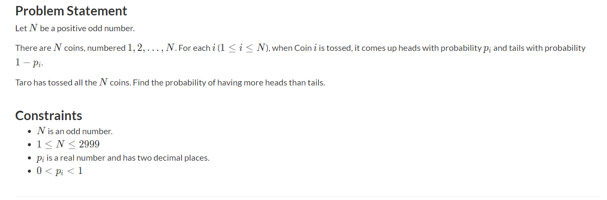

# Coins AtCoder

### Statement

### Solution
Honestly this problem is a pretty fun one. The solution
is built upon an observation that we can compute a two dimensional $dp$ table representing whether it is possible to get $i$ heads using $j$ first coins. Next we can consider two events

1. The $j$-th coin is heads. Then the probability of getting $i$ heads is: p_heads[i] * dp[i-1][j-1].
2. The $j$-th coin is tails. Then the probability of getting $i$ heads is: p_tails[i] * dp[i][j-1].