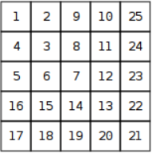

# Number Spiral (CSES)

### Problem Statement

In the problem we are given a spiral

 

and are supposed to answer queries about the number at row r and column c

### Solution

Asked about coordinates r and c, we can calculate the square contained by them using formula $ (m-1)^2$ where m is the max of those two values. 

If $m$ is odd then we can calculate $m^2$ and depending on whether r or c is greater, either substract $r - 1$ from $m^2$ or add add c to the contained square.

For even $m$ the operations on r and c are simply reversed.
